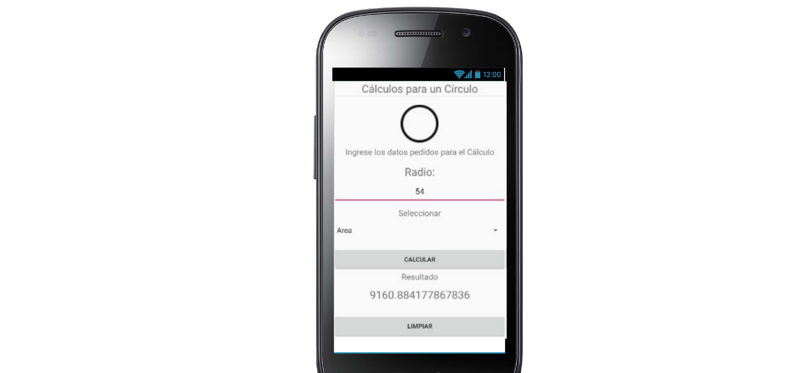
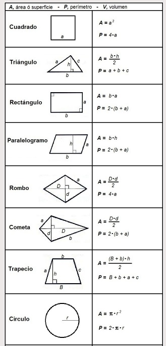

# EVA1_DAMII
Desarrollo Aplicaciones móviles II

<!DOCTYPE html>
<html>
  <head>
    <meta charset="utf-8">
    <title>Mi pagina de prueba</title>
  </head>
  <body>
    <h1>Calculadora de figuras geometricas</h1>
    

      
    

    

    

      
    

    

    

      
    

    

    

      
    

    

    

      
    

  </body>
  

  <h1>Fórmulas</h1>
    

      
    

</html>
